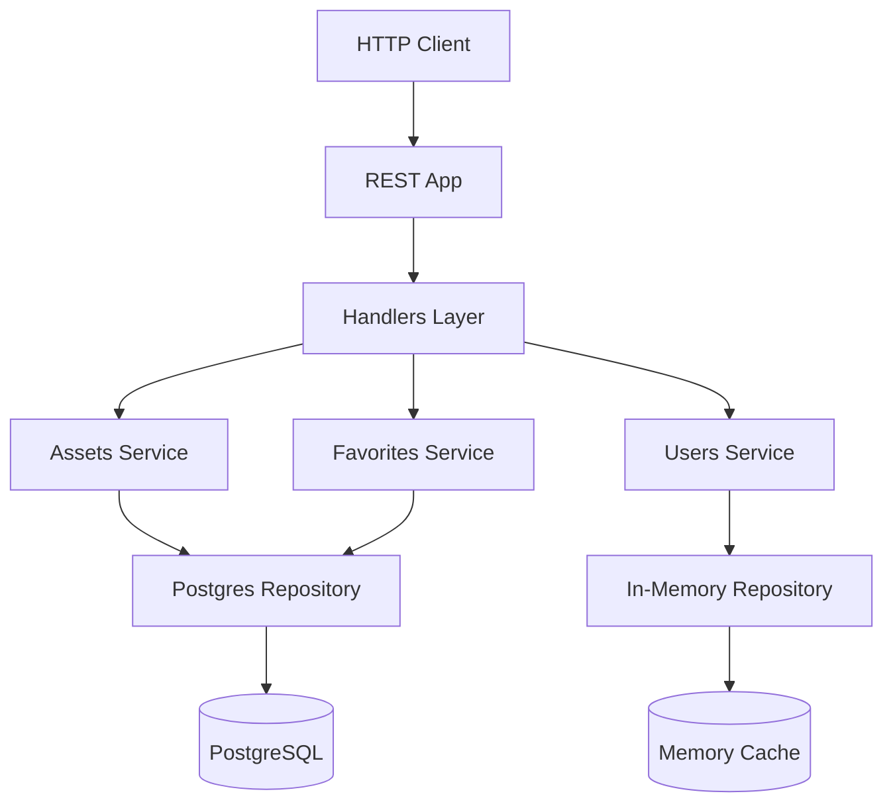

# Platform Go Challenge Solution

- [Overview](#overview)
- [Testing the Solution (Demo)](#testing-the-solution-demo)
- [System Design](#system-design)
- [Prerequisites](#prerequisites)
- [Running the Application](#running-the-application)
- [API Documentation](#api-documentation)
- [Testing](#testing)
- [Code Quality](#code-quality)
- [Project Structure](#project-structure)

## Overview

Welcome to my Platform Go Challenge Solution - PGC!
First, I'd like to express my [appreciation](https://alesr.github.io/posts/job-quest/) for the challenge requirements, which provided me with an enjoyable programming experience over the past few days.

While implementing this solution, I made several assumptions and established some *product requirements* to drive my implementation in a way that reflects a somewhat real-world scenario. I've included extensive comments throughout the code to help you follow my thought process. I hope you don't mind them.

## Testing the Solution (Demo)

Let's start with the most important part.

To launch the application in a Docker container, run:

```shell
make docker-up
```

This command will start both the application and PostgreSQL database containers.

The application automatically provisions test users and assets during initialization.
Any API endpoint requiring user or asset IDs must use these test resources.

If you prefer running the app outside Docker, you can use `make run` which will run only the Postgres DB on a container. Note that I'm using the new `omitzero` JSON tag that comes with the new 1.24 version. I haven't tested the code on previous Go versions. If you don't want to install the new Go version, stick with the Docker setup. Everything else, including the HTTP port, will remain the same regardless of how you choose to run the app.

To list test users after initializing the API:

```shell
curl "http://localhost:8090/users"
```

For listing available assets (charts, insights, audiences), call:

```shell
curl "http://localhost:8090/assets?pageSize=10&maxResults=100"
```

Once you have obtained the test user and asset IDs from the previous steps, you can mark an asset as a favorite by making the following request:

```shell
curl -X POST "http://localhost:8090/assets/favorite" \
  -H "Content-Type: application/json" \
  -d '{
    "user_id": "[your-selected-user-id]",
    "asset_id": "[your-selected-asset-d]",
    "description": "A description of your choice."
  }'
```

To update the description of a favorited asset:

```shell
curl -X PATCH "http://localhost:8090/users/[your-selected-user-id]/favorites/[favorite-id-from-previous-step]" \
  -H "Content-Type: application/json" \
  -d '{
    "description": "Your updated description"
  }'
```

Finally, to remove a favorite:

```shell
curl -X DELETE "http://localhost:8090/users/01JM9RECVAMFMY137JMWXEEW9A/favorites/[favcorite-id-from-previous-steps]"
```

Check the API Documentation section for more details.

### E2E Tests and Demo

I've designed the end-to-end tests to demo application in a convenient way.

When you run `make test-e2e-docker`, you should see output similar to:

```shell
=== RUN   TestE2E

Listing users...
User selected: Miss Madge Kohler

Listing assets...
Asset selected: 01JM9XYX2AMZBCCR4XWHCP3G1M (Type: AUDIENCE)

Creating favorite...
Favorite created with description: "Test favorite"

Retrieving favorites...
Favorite found: 01JM9XYXJT9VEBRR55AVC9J33V with description: "Test favorite"

Updating favorite...
Favorite updated successfully from "Test favorite" to "Updated description"

Deleting favorite...
Verifying deletion...
Favorite successfully deleted
--- PASS: TestE2E (0.53s)
PASS
```

## System Design



## Prerequisites

- Docker
- Go 1.24 for running the application outside Docker containers (I'm using a new feature =])

## Running the Application

### Locally

1. Run the application:

```bash
make run
```

This command starts a PostgreSQL container and runs the application locally.
The server will be available at `http://localhost:8090`

### With Docker

1. Build and start all services:

```bash
make docker-up
```

This command launches both the database and application containers.

## API Documentation

For a comprehensive list of all available endpoints, you can start a Docker container serving the API specification with the following command:

1. Start the documentation server:
```bash
make docs-up
```

2. Visit `http://localhost:4567` in your browser.
Note that this page usually takes a couple of seconds to become available.

3. Stop the documentation server:
```bash
make docs-down
```

## Testing

### Running Tests Locally (requires Go 1.24)

1. Unit tests:
```bash
make test-unit
```

2. Integration tests:
```bash
make test-it
```

3. End-to-end tests:
```bash
make test-e2e
```

4. Run all tests:
```bash
make test-all
```

### Running Tests in Docker

1. Unit tests:
```bash
make test-unit-docker
```

2. Integration tests:
```bash
make test-it-docker
```

3. End-to-end tests:
```bash
make test-e2e-docker
```

4. Run all tests:
```bash
make test-all-docker
```

## Code Quality

Run all code quality checks:
```bash
make check-all
```

This includes:
- Code formatting
- Go vet
- Vulnerability checking

## Available Make Commands

Run `make help` to see all available commands and their descriptions.

## Project Structure

```
.
├── api                       # API-specific code
│   └── resterrors           # Transport error mapping
├── build                    # Docker and build configurations
├── cmd                      # Application setup and initialization
│   └── pgc
├── docs                     # API documentation
│   └── source
│       └── includes
├── internal
│   ├── app                  # HTTP server and REST API
│   │   └── rest
│   │       └── handlers
│   ├── assets              # Service for assets management
│   │   ├── favorites       # Subpackage with service for managing user's favorite assets
│   │   ├── postgres        # Repository implementation for assets and favorites
│   │   └── sampler         # Samples the DB with test assets
│   ├── pkg
│   │   ├── dbmigrations
│   │   ├── envutil
│   │   ├── httputil
│   │   │   └── middleware
│   │   └── logutil
│   └── users               # User service
│       ├── inmemorydb
│       └── sampler         # Samples the DB with test users
├── migrations
└── tests
    ├── e2e
    └── integration
```

## A Few Notes

I've aimed for proper testing coverage and I would certainly add many more unit tests if I had time. However, I had to find *a* balance between designing and implementing the application, and showing you that I really care about *having* a sensible coverage."

I hope you enjoy my solution and I'm looking forward to your feedback. Peace ✌️
